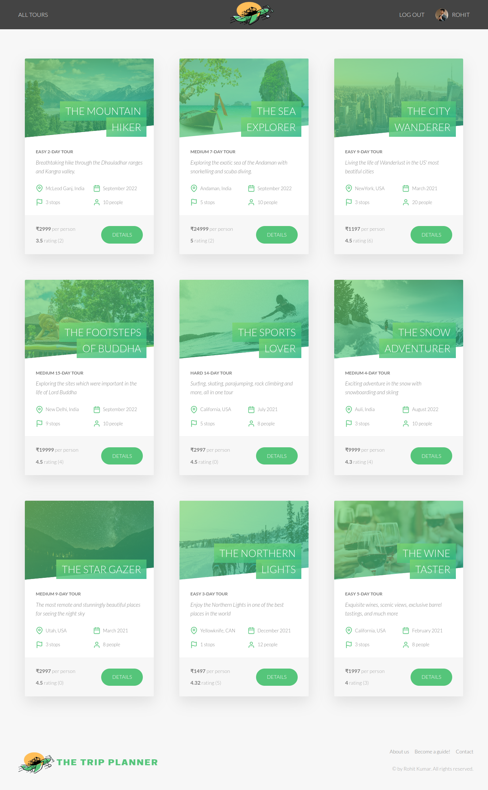
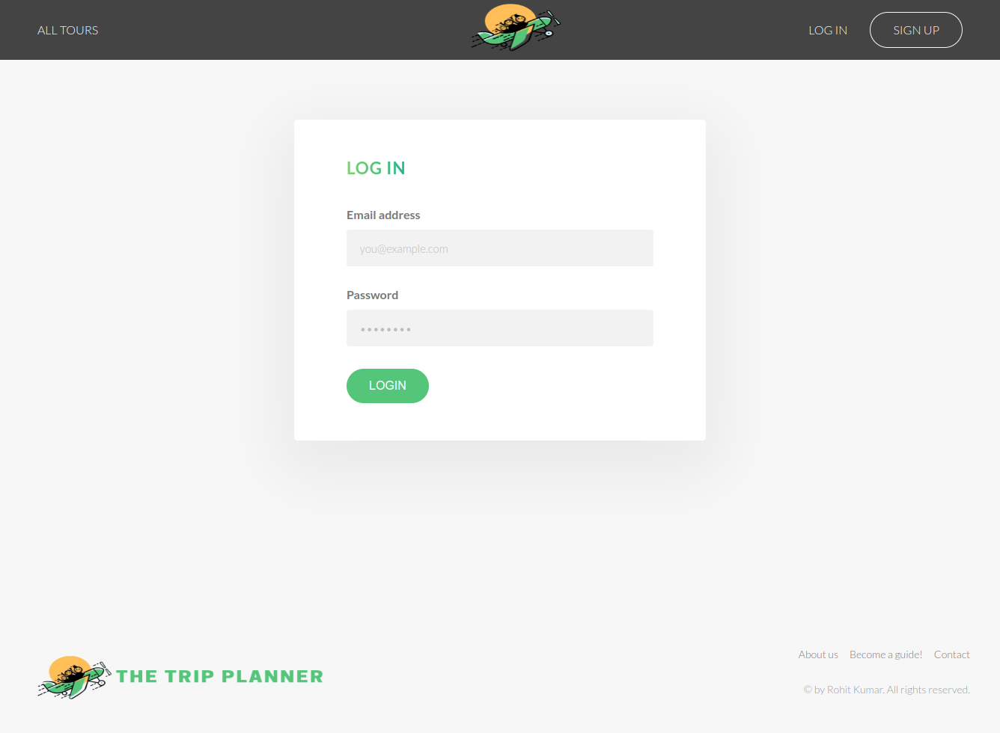
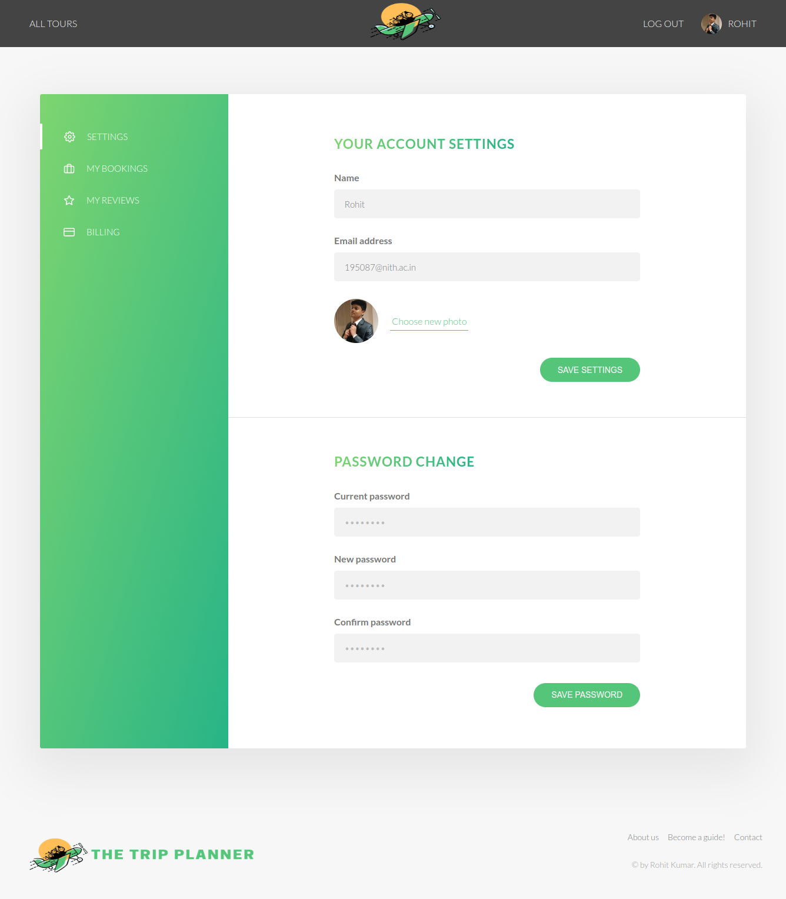
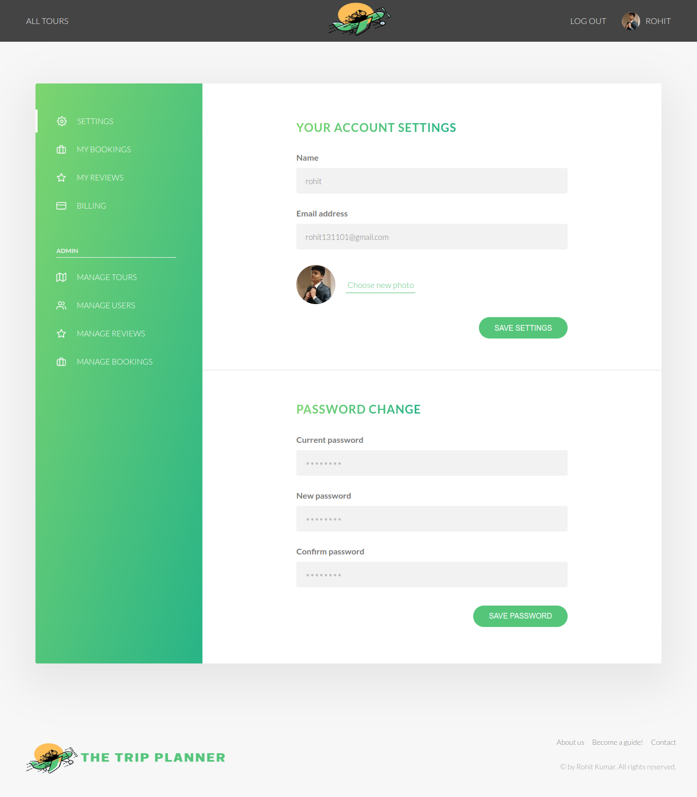

# The Trip Planner 
- A Tour planning web application in which a each tour has its own description, guides, reviews given by the users,...
- User can see other’s reviews on the Tours & can write their own review.
- CRUD operations are supported on reviews, users, and tours.
- User can Signup / Login and later authentication is done using JSON Web Token (JWT).
- Various functionalities are restricted to Admin or User.
- Frontend built using HTML, Pug, CSS & JavaScript.
- The back-end consitutes of REST-APIs with node.js, express.js and MongoDB as database.

### Preview :

### Tour details (THE FOOTSTEPS OF BUDDHA TOUR) :

### User Signup/ Login :

### User Settings/ Update :

### Admin related functionalities :
manage tours, manage users, manage reviews, manage bookings 

### Complete source code at :-
- https://github.com/rohit-13/The-Trip-Planner
